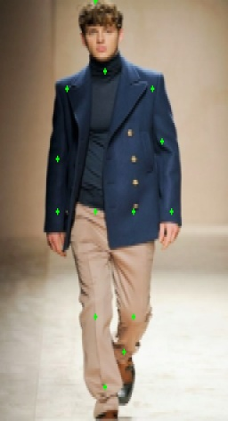

### etos-simplepose

- simple pose estimation for [ETOS](https://etos.world) ecosystem.

- for real time and high efficiency: 
   
   * only for single person pose estimation 
   * using lightweight CPM and Hourglass model  
   * Instead of normal convolution, inverted residuals (also known as Mobilenet V2) module has been used inside the model for **real-time** inference. 

-  running this model with a normal pc webcam can achieve 15fps+ on [ETOS](https://etos.world) system, with high accuracy.

##3 Training

### Dependencies:

* Python3
* TensorFlow >= 1.4

```
pip install -r requirements.txt
```

### Dataset:

Training dataset available through [google driver](https://drive.google.com/open?id=1zahjQWhuKIYWRRI2ZlHzn65Ug_jIiC4l).

Unzip it will obtain the following file structure

```bash
$ tree -L 1 .
.
├── ai_challenger_train.json
├── ai_challenger_valid.json
├── train
└── valid
```

The traing dataset only contains single person images and it come from the competition of [AI Challenger](https://challenger.ai/datasets/keypoint). 

* 22446 training examples
* 1500 testing examples

the annotation was transferred into COCO format for using the data augument code from [tf-pose-estimation](https://github.com/ildoonet/tf-pose-estimation) respository.
Beside, you also need to install [cocoapi](https://github.com/cocodataset/cocoapi)

### Hyper-parameter

In training procedure, we use `cfg` file for passing the hyper-parameter.

Below is the content of `mv2_hourglass.cfg`.

```bash
[Train]
model: 'mv2_hourglass'
checkpoint: False
datapath: '~/data/ai_challenger'
imgpath: '~/data/'
visible_devices: '1'
multiprocessing_num: 16
max_epoch: 1000
lr: '0.001'
batchsize: 16
decay_rate: 0.95
input_width: 192
input_height: 192
n_kpoints: 14
scale: 4
identify_occlusion: False
modelpath: '~/data/trained/mv2_hourglass_deep/models'
logpath: '~/data/trained/mv2_hourglass_deep/log'
num_train_samples: 25000
per_update_tensorboard_step: 500
per_saved_model_step: 500
pred_image_on_tensorboard: False
```

The cfg not cover all the parameters of the model, there still have some parameters in the `network_mv2_hourglass.py`.

#### training

```bash
python3 train.py mv2_hourglass.cfg
```

### Bechmark (PCKh)

Run the follow command to evaluate the value of your PCKh.

```bash
python3 src/benchmark.py --frozen_pb_path=hourglass/model-360000.pb \
--anno_json_path=~/data/ai_challenger/ai_challenger_valid.json \
--img_path=~/data \
--output_node_name=hourglass_out_3
```


### pc webcam demo

```
python test.py
```




### Reference

***

[1] [Paper of Convolutional Pose Machines](https://arxiv.org/abs/1602.00134) <br/>
[2] [Paper of Stack Hourglass](https://arxiv.org/abs/1603.06937) <br/>
[3] [Paper of MobileNet V2](https://arxiv.org/pdf/1801.04381.pdf) <br/>
[4] [Repository PoseEstimationForMobile](https://github.com/edvardHua/PoseEstimationForMobile) <br/>
[5] [Repository of tf-pose-estimation](https://github.com/ildoonet/tf-pose-estimation) <br>
[6] [Devlope guide of TensorFlow Lite](https://github.com/tensorflow/tensorflow/tree/master/tensorflow/docs_src/mobile/tflite) <br/>
